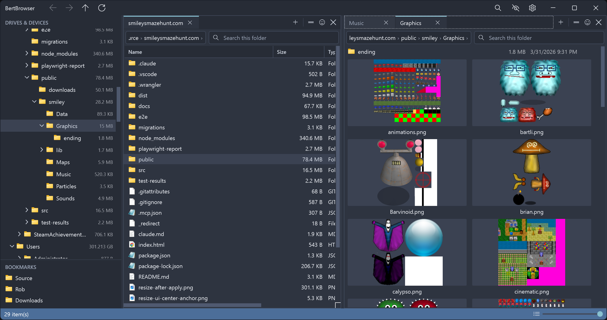
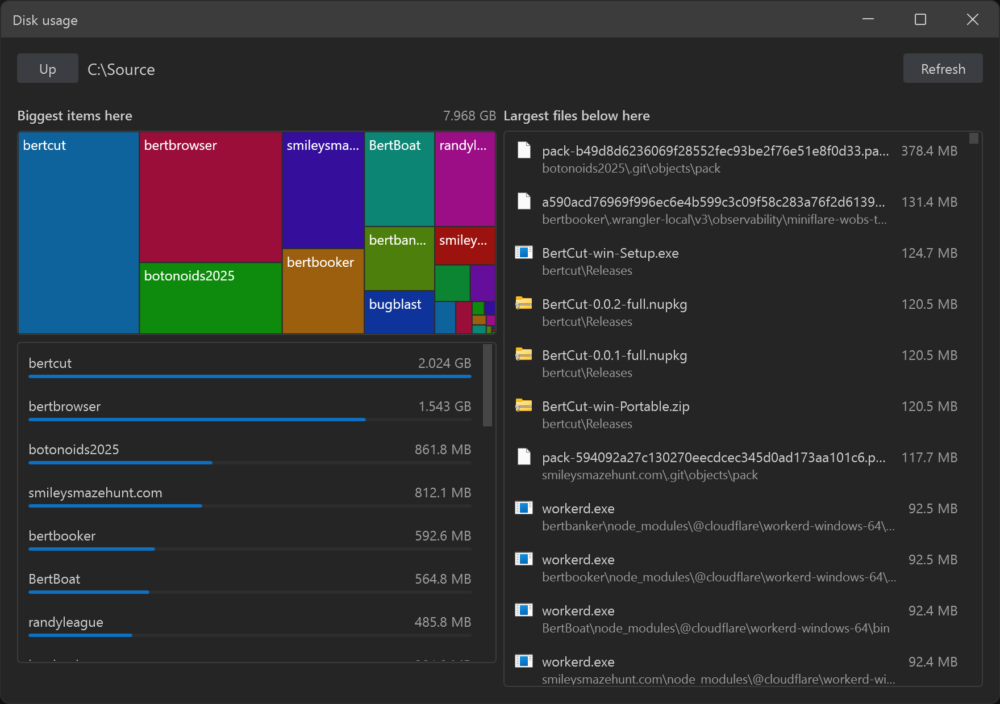

# bertbrowser

[](https://github.com/robgwalsh/bertbrowser/releases/latest)
[](https://github.com/robgwalsh/bertbrowser/releases/tag/unstable)
[](https://github.com/robgwalsh/bertbrowser/actions/workflows/unstable.yml)

An offline Windows 10/11 file browser built for my personal preferences.

<table>
<tr>
<td width="57%"></td>
<td width="43%"></td>
</tr>
</table>

- **Offline** - BertBrowser does not connect to the Internet except a startup check against [GitHub Releases](https://github.com/robgwalsh/bertbrowser/releases) for app updates.
- **[Fast global search](docs/search-indexing.md)** - MFT indexing and USN journal tracking for fastest possible performance.
- **Directory sizes** — Show total size on directories, just like files.
- **Split panes with tabs** - Infinite pane splitting and tabs per pane.
- **Themes** - Rich theming system, with many pre-loaded themes.

## Install

```powershell
winget install RobWalsh.BertBrowser
```

* **Or** grab the [latest installer](https://github.com/robgwalsh/bertbrowser/releases/latest/download/BertBrowser-win-Setup.exe) and run it.
* **Or** download the [latest portable executable](https://github.com/robgwalsh/bertbrowser/releases/latest/download/BertBrowser-win-Portable.zip) if you'd rather not install anything.

### Unstable

The latest code in `main`, rebuilt and published on every push. It gets the same test suite a release
gets and none of the settling time.

* Grab the [unstable installer](https://github.com/robgwalsh/bertbrowser/releases/download/unstable/BertBrowser-unstable-Setup.exe), or the [unstable portable build](https://github.com/robgwalsh/bertbrowser/releases/download/unstable/BertBrowser-unstable-Portable.zip).

It **replaces an installed copy** rather than sitting beside it, and from then on that copy updates
along unstable instead of along releases. The title bar says which you are on — `BertBrowser 1.1.3-unstable.42`
against `BertBrowser 1.1.2`. Your data in `%USERPROFILE%\.bertbrowser` is untouched either way, and
running the [stable installer](https://github.com/robgwalsh/bertbrowser/releases/latest/download/BertBrowser-win-Setup.exe)
over the top puts you back.

## Building and running

```powershell
git clone https://github.com/robgwalsh/bertbrowser.git
cd bertbrowser

dotnet build bertbrowser.sln       # build
dotnet test bertbrowser.sln        # run tests
dotnet run --project src/BertBrowser.App              # launch
dotnet run --project src/BertBrowser.App -- C:\Some\Dir   # launch at a specific folder
```

Note that warnings are treated as errors across the solution (`Directory.Build.props`), so a clean build is a warning-free build.

See [docs/build-and-release.md](docs/build-and-release.md) for packaging, the tag-driven release workflow, and how updates reach installed copies.

## Testing the interface

`tools/BertBrowser.Harness` allows testing the BertBrowser in a headless way: it builds the app's own service graph and shows the real
`MainWindow` parked outside every monitor and refused activation, then drives it with a small script
language and captures it with `RenderTargetBitmap` — a software re-render of the visual tree, so
being offscreen and covered costs nothing.

```powershell
$harness = "tools\BertBrowser.Harness\bin\Debug\net10.0-windows\BertBrowser.Harness.exe"

& $harness --script tools\ui\smoke.bbs      # browse, search, move, rename, delete, undo
& $harness --script tools\ui\themes.bbs     # every built-in theme, and the dialogs
& $harness --script tools\ui\tree.bbs --sandbox C:\Source\treecheck --allow-outside
& $harness -c "tree .; refresh; shot look"  # ad hoc; prints the PNG path
& $harness --help
```

Each run gets a throwaway fixture tree and its own scratch `BERTBROWSER_DATA_DIR`, so it never
touches your real index, settings or themes. It starts no programs, never touches the clipboard, and
refuses to write outside its sandbox — the harness drives the real transfer, rename and delete
executors, not stubs.

## Data locations

| What | Where |
|---|---|
| Size-cache + search-index database | `%USERPROFILE%\.bertbrowser\bertbrowser.db` |
| Window/session settings | `%USERPROFILE%\.bertbrowser\settings.json` |

Delete the folder to reset the app completely.

## Project layout

- `src/BertBrowser.Core` — everything testable and UI-free: SQLite persistence and migrations, path canonicalization, search-index and directory-size services.
- `src/BertBrowser.App` — the WPF shell (MVVM via CommunityToolkit.Mvvm, DI via Microsoft.Extensions.DependencyInjection).
- `tests/BertBrowser.Core.Tests` — xUnit tests for Core; they run against real temp SQLite databases and directory trees.
- `tools/BertBrowser.Harness` — hosts the real window offscreen and scripts it; `tools/ui/*.bbs` are the scripts.

See [CLAUDE.md](CLAUDE.md) for a deeper architecture walkthrough (path-key invariants, migrations, the size-scan algorithm).

## License

[MIT](LICENSE)
